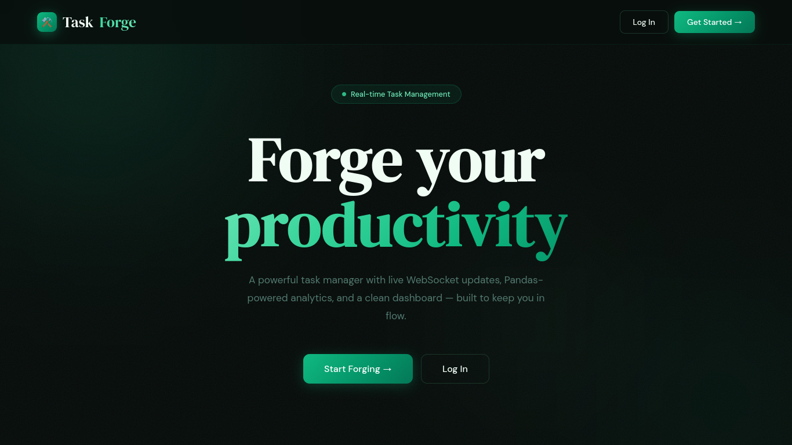
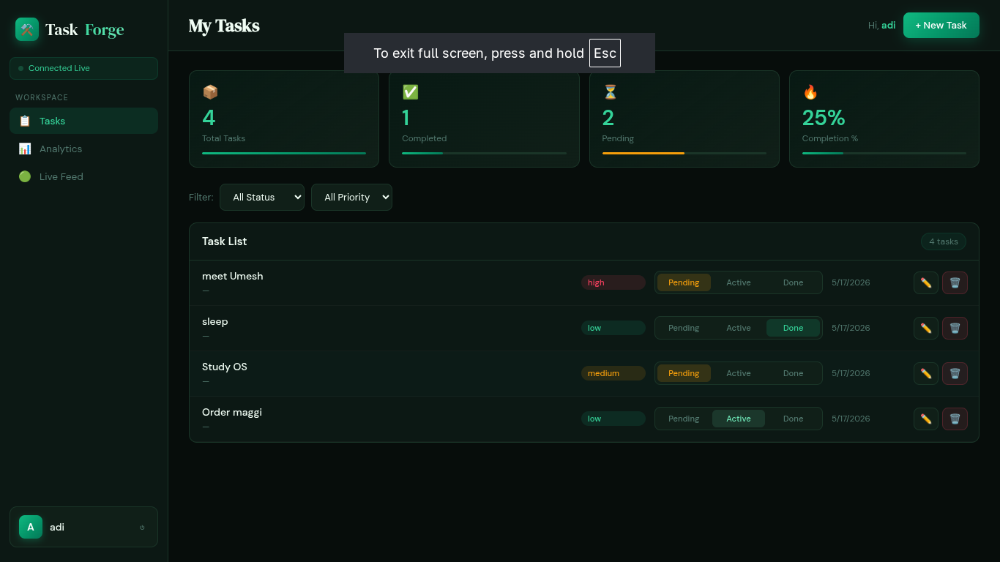
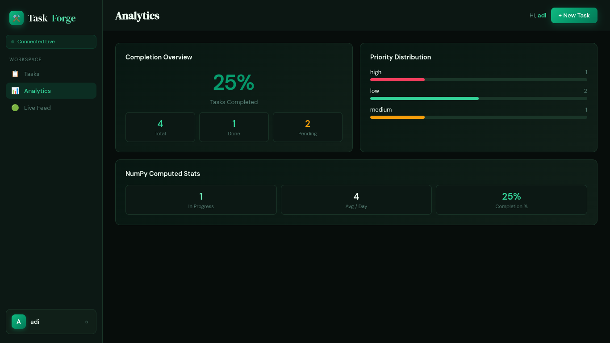

# ⚒️ TaskForge

**TaskForge** is a full-stack productivity web app with authentication, task management, live updates via WebSockets, and built-in analytics powered by Pandas and NumPy.

## 🌐 Live Demo

**Deployed Link:** `<!-- TODO: Add deployed app URL here -->`

## ✨ Features

- Secure register/login/logout flow with password hashing
- Task CRUD with filtering by status and priority
- Real-time task + analytics updates using Flask-SocketIO
- Analytics dashboard: totals, completion %, priority distribution, average tasks/day
- Clean dark-themed landing page and dashboard UI

## 🧱 Tech Stack

| Layer | Stack |
|---|---|
| Backend | Flask, Flask-SocketIO |
| Database | PostgreSQL, psycopg2 |
| Analytics | Pandas, NumPy |
| Frontend | HTML, CSS, Vanilla JavaScript |
| Auth | Flask sessions, Werkzeug password hashing |

## 📸 Screenshots

### Landing Page


### Dashboard


### Tasks / Analytics View


## 📁 Project Structure

```bash
taskforge/
├── app.py
├── schema.sql
├── requirements.txt
├── .env.example
├── README.md
├── LICENSE
├── demo1.png
├── demo2.png
├── demo3.png
└── templates/
    ├── landing.html
    └── dashboard.html
```

## 🚀 Local Setup

1. Clone the repo and move into the project folder.
2. Create and activate a virtual environment.
3. Install dependencies.
4. Create PostgreSQL database and configure environment variables.
5. Run the app.

```bash
# 1) Clone
git clone <your-repo-url>
cd taskforge

# 2) Virtual environment
python -m venv venv
source venv/bin/activate

# 3) Install dependencies
pip install -r requirements.txt

# 4) Database setup
psql -U postgres -c "CREATE DATABASE taskforge;"
psql -U postgres -d taskforge -f schema.sql

# 5) Environment file
cp .env.example .env

# 6) Start app
python app.py
```

App runs at: **http://localhost:5000**

## 🔐 Environment Variables

```env
SECRET_KEY=your-super-secret-key-change-this
DB_HOST=localhost
DB_PORT=5432
DB_NAME=taskforge
DB_USER=postgres
DB_PASSWORD=your_postgres_password
```

## 🔌 API Overview

| Method | Endpoint | Purpose |
|---|---|---|
| POST | `/api/register` | Register user |
| POST | `/api/login` | Login user |
| POST | `/api/logout` | Logout user |
| GET | `/api/tasks` | List tasks (supports `status`, `priority`) |
| POST | `/api/tasks` | Create task |
| PUT | `/api/tasks/<id>` | Update task |
| DELETE | `/api/tasks/<id>` | Delete task |
| GET | `/api/analytics` | Fetch analytics data |

## 📜 License

This project is licensed under the MIT License. See [LICENSE](./LICENSE).
